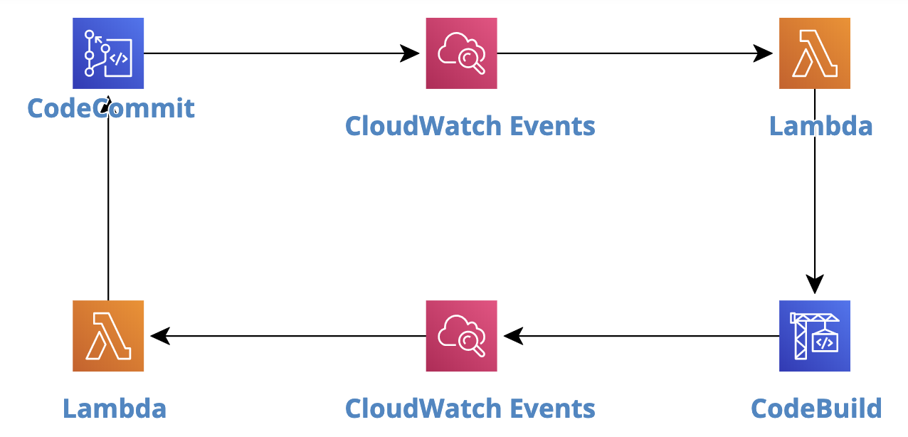

# AWS CodeCommit

완전 관리형 형상관리 또는 버전관리 서비스로 고가용성, 확장성 및 안정성을 내재한 Git Repository를 제공합니다. 모든 소스코드는 암호화되어 전송 및 저장이 되고 Repository 크기는 무한대로 확장이 가능하며 어떤한 파일도 저장이 가능합니다. 다른 AWS 서비스들과 (AWS CodeBuild, CodeDeploy, CodePipeline, etc) 연계를 통해서 보다 나은 CI/CD 파이프라인을 구축할수 있습니다.

## 시작하기전에

1. 본 Hands-on lab은 AWS Seoul region 기준으로 작성되었습니다. Region을 Seoul (ap-northeast-2)로 변경 후 진행 부탁드립니다.
2. [AWS Credit 추가하기](https://aws.amazon.com/ko/premiumsupport/knowledge-center/add-aws-promotional-code/)
3. [Lab 환경 구축](https://ap-northeast-2.console.aws.amazon.com/cloudformation/home?region=ap-northeast-2#/stacks/quickcreate?templateURL=https://saltware-aws-lab.s3.ap-northeast-2.amazonaws.com/codecommit/lab.yml&stackName=codecommit)

## Repository에 연결

### HTTPS

1. CloudFormation으로 생성된 IAM user로 AWS Management Console 로그인

    ```text
    IAM user name: lead
    Password: asdf1234
    ```

2. AWS Management Console에서 좌측 상단에 있는 **[Services]** 를 선택하고 검색창에서 IAM를 검색하거나 **[Security, Identity, & Compliance]** 바로 밑에 있는 **[IAM]** 를 선택

3. IAM Dashboard에서  **[Users]** 클릭 &rightarrow; lead를 선택 &rightarrow; **[Security credentials]** &rightarrow; HTTPS Git credentials for AWS CodeCommit 밑에 있는 **[Generate credentials]** 를 클릭 후 User name과 Password를 메모

4. AWS Management Console 좌측 상단에 있는 **[Services]** 를 선택하고 검색창에서 ssm를 검색하고 **[Systems Manager]** 를 선택

5. Systems Manager Dashboard 왼쪽 패널 Instances & Nodes 섹션 아래에 있는 **[Session Manager]** 선택

6. **[Start Session]** &rightarrow; Instance Name: **lead** 선택 &rightarrow; **[Start Session]** 클릭

    - Home Directory로 이동

        ```bash
        cd
        ```

    - Git 설치

        ```bash
        sudo yum install git -y
        ```

    - Git 유저 설정

        ```bash
        git config --global user.email "you@example.com"
        git config --global user.name "Your Name"
        ```

    - Clone CodeCommit Repository

        ```bash
        git clone https://git-codecommit.ap-northeast-2.amazonaws.com/v1/repos/guess
        ```

    - 위에서 만든 Git credentials 입력

        ```bash
        Username for 'https://git-codecommit.ap-northeast-2.amazonaws.com':
        Password for 'https://lead-at-xxxxxxxxx@git-codecommit.ap-northeast-2.amazonaws.com':
        ```

    - Clone 해당 Github Repository

        ```bash
        git clone https://github.com/woowhoo/code-commit.git
        ```

    - 소스코드 복사

        ```bash
        cp code-commit/*.py guess/
        ```

    - Git credentials 저장을 원할경우 (Optional)

        ```bash
        git config credential.helper store
        ```

    - CodeCommit Repository로 소스코드를 push

        ```bash
        cd guess
        git add main.py test.py
        git commit -m "initial commit"
        git push
        ```

7. IAM Dashboard에서  **[Users]** 클릭 &rightarrow; lead를 선택 &rightarrow; **[Permissions]** 섹션 오른쪽에 있는 **[:heavy_plus_sign: Add inline policy]** 클릭후,
**Service** = CodeCommit, **Actions** = GitPush, **Resources** 탭에 있는 **[Add ARN]** 클릭 &rightarrow; **Region** = ap-northeast-2, **Repository name** = guess &rightarrow;  **[Add]**

8. **[Review Policy]** &rightarrow; **Name** = codecommit-lead-access &rightarrow; **[Create Policy]**

9. ```git push``` 재시도

### SSH

1. AWS Systems Manager Session Manager를 통해서 **dev** 인스턴스로 연결
    - RSA Key Pair 생성

        ```bash
        ssh-keygen
        ```

    - RSA Public Key를 클립보드로 복사

        ```bash
        cat ~/.ssh/id_rsa.pub
        ```

2. IAM Dashboard에서  **[Users]** 클릭 &rightarrow; dev를 선택 &rightarrow; **[Security credentials]** &rightarrow; HTTPS Git credentials for AWS CodeCommit 밑에 있는 **[Upload SSH public key]** 클릭 &rightarrow; 클립보드 내용 붙여넣기 &rightarrow; **[Upload SSH public key]** &rightarrow; SSH key ID를 메모

3. 다시 EC2 세션으로 돌아와서

    - Home Directory로 이동

        ```bash
        cd
        ```

    - Git 설치

        ```bash
        sudo yum install git -y
        ```

    - Git 유저 설정

        ```bash
        git config --global user.email "you@example.com"
        git config --global user.name "Your Name"
        ```

    - 로컬 SSH 연결 설정

        ```bash
        vi ~/.ssh/config
        ```

        ```text
        Host git-codecommit.*.amazonaws.com
        User Your-IAM-SSH-Key-ID-Here
        IdentityFile ~/.ssh/id_rsa
        ```

        ```bash
        chmod 600 ~/.ssh/config
        ```

    - Clone CodeCommit Repository

        ```bash
        git clone ssh://git-codecommit.ap-northeast-2.amazonaws.com/v1/repos/guess
        ```

4. 어플리케이션을 1 ~ 20까지의 숫자를 맞추는걸로 수정하고 Git Repository에 변경사항 반영

## Branching

1. 다시 EC2 세션으로 돌아와서 Git Branch 생성 후 Origin으로 Push

    ```bash
    git checkout -b feature-max20
    git push -u origin feature-max20
    ```

2. IAM Dashboard에서  **[Users]** 클릭 &rightarrow; dev를 선택 &rightarrow; **[Permissions]** 섹션 아래 **[Add permissions]** &rightarrow; **[Attach existing policies directly]** &rightarrow; :white_check_mark: AWSCodeCommitPowerUser 선택 &rightarrow; **[Next: Review]** &rightarrow; **[Add permissions]**

3. **[:heavy_plus_sign: Add inline policy]** 클릭 &rightarrow; **JSON** 선택 후 아래 내용 붙여넣고 **[Review policy]** 

    ```json
    {
        "Version": "2012-10-17",
        "Statement": [
            {
                "Effect": "Deny",
                "Action": [
                    "codecommit:GitPush",
                    "codecommit:DeleteBranch",
                    "codecommit:PutFile",
                    "codecommit:MergePullRequestByFastForward"
                ],
                "Resource": "arn:aws:codecommit:ap-northeast-2:<ACCOUNT_NUMBER>:guess",
                "Condition": {
                    "StringEqualsIfExists": {
                        "codecommit:References": [
                            "refs/heads/master"
                        ]
                    },
                    "Null": {
                        "codecommit:References": false
                    }
                }
            }
        ]
    }
    ```

4. **Name** = DenyChangesToMaster &rightarrow; **[Create policy]**

5. 다시 EC2 세션으로 돌아와서 Git Branch를 Origin으로 Push 재시도

    ```bash
    git push -u origin feature-max20
    ```

## Pull Request & Merging branch

1. `dev` IAM user로 AWS Management Console 로그인

    ```text
    IAM user name: dev
    Password: asdf1234
    ```

2. AWS Management Console에서 좌측 상단에 있는 **[Services]** 를 선택하고 검색창에서 CodeCommit을 검색하거나 **[Developer Tools]** 밑에 있는 **[CodeCommit]** 를 선택

3. `guess` Repository를 선택 &rightarrow; 왼쪽 패널에서 **[Branches]** &rightarrow; **[Create pull request]** 클릭 &rightarrow; **Destination** = master, **Source** = feature-max20 &rightarrow; **[Compare]**

4. **Title** = NEW-01 최댓값 변경, **Description** = 사용자 XXX의 요청으로 최댓값을 20으로 변경 &rightarrow; **[Create pull request]**

5. `lead` IAM user로 AWS Management Console 로그인하고 AWSCodeCommitPowerUser 권한 부여

6. CodeCommit Dashboard에서 Pull requests 섹션으로 이동

7. **NEW-01 최댓값 변경** Pull request를 선택 &rightarrow; **[Approve]** &rightarrow; **[Merge]** &rightarrow; **[Merge pull request]**

8. Master branch의 소스코드에 변경사항이 적용 됬는지 확인

## Test Automation



1. 개발자가 Pull Requeust 생성

2. CloudWatch Events에서 Pull Request에 대한 이벤트를 인지하고 Lambda 실행

3. Lambda function을 통해서 CodeBuild에 있는 Test 빌드 실행

4. CloudWatch Events에서 Test 빌드의 상태변화를 인지하고 Lambda 실행

5. Test 빌드의 상태를 Pull Request 댓글에 기록

### CodeBuild

1. AWS Management Console에서 좌측 상단에 있는 **[Services]** 를 선택하고 검색창에서 CodeBuild를 검색하거나 **[Developer Tools]** 밑에 있는 **[CodeBuild]** 를 선택

2. **[Create build proejct]** &rightarrow; **Project name** = guess-unittest, **Source provider** = AWS CodeCommit, **Repository** = guess, **Reference type** = Branch, **Environment image** = Managed Image, **Operating system** = Amazon Linux 2, **Runtime(s)** = Standard, **Image** = aws/codebuild/amazonlinux2-x86_64-standard:2.0, **Service role** = New service role, **Build specifications** = Insert build commands &rightarrow; **[Switch to editor]** &rightarrow; 아래 커맨드블록을 Build commands에 붙여놓고 **[Create build project]**

    ```yaml
    version: 0.2

    phases:
    install:
        runtime-versions:
        python: 3.8
    build:
        commands:
        - python3 -m unittest
    ```

### Lambda

1. AWS Management Console에서 좌측 상단에 있는 **[Services]** 를 선택하고 검색창에서 Lambda를 검색하거나 **[Compute]** 밑에 있는 **[Lambda]** 를 선택

2. Lambda Dashboard에서  **[Create function]** 클릭후,
  **Function name** = run_testbuild,
  **Runtime** = Python 3.8,
  **[Create function]** 클릭

3. 좌측 하단에 있는 **[Execution role]** 에서 **View the run_testbuild-role-xxxx** on the IAM console 를 선택

4. **[Permissions]** 섹션 오른쪽에 있는 **[:heavy_plus_sign: Add inline policy]** 클릭후,
**Service** = CodeBuild, **Actions** = StartBuild, **Resources** 탭에 있는 **[Add ARN]** 클릭 &rightarrow; **Region** = ap-northeast-2, **Project name** = guess-unittest &rightarrow;  **[Add]** 

5. **[Review Policy]** &rightarrow; **Name** = allow-lambda-run-codebuild &rightarrow; **[Create Policy]**

6. 아래 코드블록을 Lambda에 복사 후, **[Save]** 클릭

    ```python
    import json
    import boto3

    def lambda_handler(event, context):

        codebuild = boto3.client('codebuild')
        response = codebuild.start_build(
            projectName = 'guess-unittest',
            sourceVersion= event['detail']['sourceCommit'],
            environmentVariablesOverride=[
                {
                    'name': 'pullRequestId',
                    'value': event['detail']['pullRequestId'],
                    'type': 'PLAINTEXT'
                },
                {
                    'name': 'repositoryName',
                    'value': 'guess',
                    'type': 'PLAINTEXT'
                },
                {
                    'name': 'destinationCommit',
                    'value': event['detail']['destinationCommit'],
                    'type': 'PLAINTEXT'
                }
            ]
        )
    ```

CloudWatch Events

1. AWS Management Console에서 좌측 상단에 있는 **[Services]** 를 선택하고 검색창에서 CloudWatch를 검색하거나 **[Management & Governance]** 밑에 있는 **[CloudWatch]** 를 선택

2. CloudWatch Dashboard에서 **[Events]** 섹션 아래에 있는 **[Rules]** &rightarrow; **[Create rule]**

3. 왼쪽 Event Source에서 :white_check_mark: Event Pattern 선택 , **Service Name** = CodeCommit, **Event Type** = CodeCommit Pull Request State Change, :white_check_mark: Specific resource(s) by ARN = CodeCommit Repository ARN 입력

4. 오른쪽 Targets에서 **[:heavy_plus_sign: Add target]** &rightarrow; **Lambda function** &rightarrow; **Function** = run_testbuild &rightarrow; **[Configure details]** 

5. **Name** = pull_request_made, **State** = :white_check_mark: Enabled &rightarrow; **[Create rule]**

Lambda

1. AWS Management Console에서 좌측 상단에 있는 **[Services]** 를 선택하고 검색창에서 Lambda를 검색하거나 **[Compute]** 밑에 있는 **[Lambda]** 를 선택

2. Lambda Dashboard에서  **[Create function]** 클릭후,
  **Function name** = post_test_result,
  **Runtime** = Python 3.8,
  **[Create function]** 클릭

3. 좌측 하단에 있는 **[Execution role]** 에서 **View the post_test_result-role-xxxx** on the IAM console 를 선택

4. **[Permissions]** 섹션 오른쪽에 있는 **[:heavy_plus_sign: Add inline policy]** 클릭후,
**Service** = CodeCommit, **Actions** = PostCommentForPullRequest, **Resources** 탭에 있는 **[Add ARN]** 클릭 &rightarrow; **Region** = ap-northeast-2, **Repository name** = guess &rightarrow;  **[Add]** 

5. **[Review Policy]** &rightarrow; **Name** = allow-lambda-post-comment-on-pr &rightarrow; **[Create Policy]**

6. 아래 코드블록을 Lambda에 복사 후, **[Save]** 클릭

    ```python
    import json
    import boto3
    import re

    def lambda_handler(event, context):
        envs = event['detail']['additional-information']['environment']['environment-variables']
        repositoryName = [var['value'] for var in envs if var['name'] == 'repositoryName'][0]
        pullRequestId = [var['value'] for var in envs if var['name'] == 'pullRequestId'][0]
        destinationCommit = [var['value'] for var in envs if var['name'] == 'destinationCommit'][0]
        buildStatus = event['detail']['build-status']
        buildArn = event['detail']['build-id']
        buildId = re.findall(r'(?<=\/)(.*)', buildArn)[0]
        sourceVersion = envs = event['detail']['additional-information']['source-version']

        codecommit = boto3.client('codecommit')
        response = codecommit.post_comment_for_pull_request(
            pullRequestId = pullRequestId,
            repositoryName = repositoryName,
            content = f'[BUILD](https://ap-northeast-2.console.aws.amazon.com/codesuite/codebuild/projects/guess-unittest/build/{buildId}): {buildStatus}',
            afterCommitId = sourceVersion,
            beforeCommitId = destinationCommit
        )
    ```

CloudWatch Events

1. AWS Management Console에서 좌측 상단에 있는 **[Services]** 를 선택하고 검색창에서 CloudWatch를 검색하거나 **[Management & Governance]** 밑에 있는 **[CloudWatch]** 를 선택

2. CloudWatch Dashboard에서 **[Events]** 섹션 아래에 있는 **[Rules]** &rightarrow; **[Create rule]**

3. 왼쪽 Event Source에서 :white_check_mark: Event Pattern 선택 후 Dropdown 리스트에서 **Custom event pattern** 선택 후 아래 블록을 붙여넣기

    ```json
    {
        "source": [
            "aws.codebuild"
        ],
        "detail-type": [
            "CodeBuild Build State Change"
        ],
        "detail": {
            "build-status": [
                "IN_PROGRESS",
                "SUCCEEDED",
                "FAILED",
                "STOPPED"
            ],
            "project-name": [
                "guess-unittest"
            ]
        }
    }
    ```

4. 오른쪽 Targets에서 **[:heavy_plus_sign: Add target]** &rightarrow; **Lambda function** &rightarrow; **Function** = post_test_result &rightarrow; **[Configure details]** 

5. **Name** = test_build_run, **State** = :white_check_mark: Enabled &rightarrow; **[Create rule]**

### 테스트

1. 새로운 Git Branch를 생성 후, 어플리케이션을 1 ~ 30까지의 숫자를 맞추는걸로 수정하고 해당 Branch를 CodeCommit에 Push하고 Pull Request 생성

2. CodeCommit Dashboard에서 방금 생성한 Pull request를 선택하고, Activity나 Changes 탭 밑에서 CodeBuild 테스트 결과 확인

3. CodeBuild 테스트 빌드가 성공하도록 소스코드 수정
